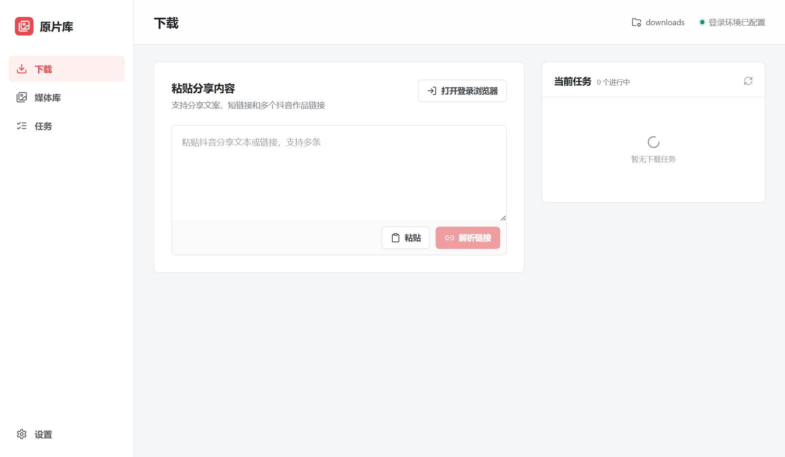
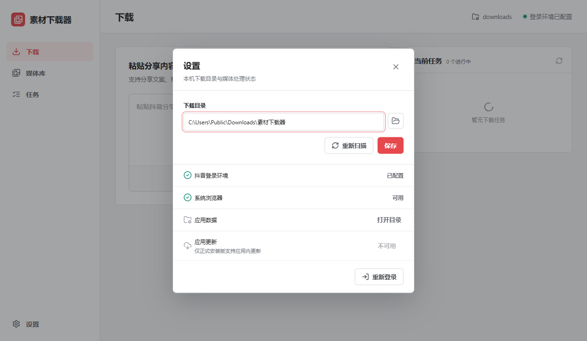

# 素材下载器

[](https://github.com/galaxywk223/original-media-library/actions/workflows/ci.yml)
[](https://github.com/galaxywk223/original-media-library/releases/latest)
[](LICENSE)

素材下载器是面向 Windows 10/11 x64 的本地抖音素材下载与管理工具。应用使用独立 Edge/Chrome 配置保存登录状态，通过 Electron 桌面界面管理下载任务、图片作品、视频文件和音频文件。



## 功能

- 从分享文案、短链接或作品链接中批量提取抖音作品。
- 下载页面返回的图片或视频资源并显示实时进度。
- 从已下载的视频提取 MP3 音频，输出码率为 192 kbps。
- 自动索引本地下载目录，按作品归组多图内容。
- 提供搜索、媒体类型筛选、排序、网格与列表视图。
- 支持媒体预览、重命名、打开文件、资源管理器定位和移入回收站。
- 使用 SQLite 保存设置、任务与媒体索引，不依赖独立服务进程。
- 使用系统 Edge 或 Chrome 完成登录，安装包内置 FFmpeg 音频转换引擎。
- 启动后自动检查 GitHub Release，支持后台下载并重启安装更新。

## 安装

最新安装包位于 [GitHub Releases](https://github.com/galaxywk223/original-media-library/releases/latest)：

```text
MediaDownloader-Setup-1.2.1.exe
```

`v1.2.1` 修复已安装版本提取音频时 FFmpeg 路径解析错误。

安装包未进行商业代码签名，Windows SmartScreen 可能显示未知发布者提示。安装范围为当前用户，卸载时保留应用数据和已下载媒体。

`v1.0.0` 不包含应用内更新模块，需要手动安装 `v1.1.0` 或更高版本完成一次升级。`v1.1.0` 起可在设置页检查并安装后续更新。

`v1.1.1` 修复应用专属浏览器在启动接管失败后残留于后台的问题。下载任务会自动接管并清理该专属实例，不影响日常使用的 Edge 或 Chrome。

`v1.1.2` 修复目录自动扫描与下载任务同时登记媒体时的索引冲突，并自动恢复证据完整的历史失败任务。

## 使用流程

1. 设置页确认系统 Edge 或 Chrome 可用。
2. “配置登录”打开独立浏览器窗口并完成抖音登录。
3. 下载页粘贴分享文案或作品链接并执行解析。
4. 选择作品并创建下载任务。
5. 媒体库完成预览、筛选和本地文件管理。



## 数据目录

| 路径 | 内容 |
| --- | --- |
| `%LOCALAPPDATA%\OriginalMediaLibrary\library.db` | SQLite 数据库 |
| `%LOCALAPPDATA%\OriginalMediaLibrary\thumbnails` | 缩略图缓存 |
| `%LOCALAPPDATA%\OriginalMediaLibrary\browser-profile` | 独立浏览器登录环境 |
| `%USERPROFILE%\Downloads\素材下载器` | 新安装的默认下载目录 |

旧版 Web 应用的工作区数据在开发模式首次启动时自动迁移到本地应用数据目录。已有安装继续使用数据库中保存的下载目录，新安装默认使用“素材下载器”目录。下载目录可在设置页修改。

## 开发

```powershell
npm ci
npm run dev
```

生产构建与安装包：

```powershell
npm run build
npm run dist
```

质量检查：

```powershell
npm run lint
npm run typecheck
npm test
npm run test:e2e
```

## 技术架构

- Electron 主进程负责窗口生命周期、SQLite、文件系统、下载队列和浏览器自动化。
- Context Bridge 暴露受限桌面 API，IPC 输入通过 Zod 校验。
- React、TypeScript、TanStack Query 与 Radix UI 构成渲染层。
- 自定义 `oml-media://` 协议按媒体 ID 提供受目录边界保护的预览流。
- electron-vite 负责三层构建，electron-builder 生成 NSIS x64 安装包。

详细边界与数据流参见 [架构说明](docs/ARCHITECTURE.md)。

## 项目边界

- 当前版本仅支持 Windows 10/11 x64。
- 当前版本不包含代码签名、托盘模式、遥测、macOS 或 Linux 构建。
- 下载能力依赖抖音页面接口与登录状态，平台变更可能导致功能失效。
- 项目不隶属于抖音、Microsoft 或 Google。
- 软件仅适用于有权访问和保存的内容。使用行为应遵守适用法律、平台条款和内容权利要求。

## 开源信息

项目使用 [MIT License](LICENSE)。第三方软件许可证见 [THIRD_PARTY_NOTICES.md](THIRD_PARTY_NOTICES.md)，隐私边界见 [PRIVACY.md](PRIVACY.md)，安全报告流程见 [SECURITY.md](SECURITY.md)。
