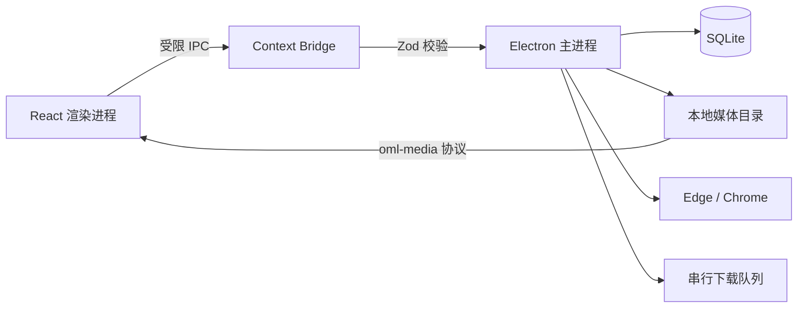

# 架构说明

## 运行结构

## 模块职责

| 模块 | 职责 |
| --- | --- |
| `src/main/index.ts` | 单实例、窗口、协议注册与应用生命周期 |
| `src/main/ipc.ts` | IPC 路由与输入校验 |
| `src/main/services.ts` | 应用服务编排、设置与目录监听 |
| `src/main/downloader.ts` | 登录浏览器、页面详情捕获与流式下载 |
| `src/main/jobs.ts` | 持久化任务队列、取消、重试与状态转换 |
| `src/main/library.ts` | 媒体扫描、分组、缩略图和文件操作 |
| `src/main/media-protocol.ts` | 受控媒体流与 Range 请求 |
| `src/preload/index.ts` | 最小桌面 API 暴露 |
| `frontend/src` | React 界面与异步状态管理 |

## 安全边界

- 渲染进程启用 `contextIsolation` 和 Electron sandbox，并禁用 Node.js 集成。
- 新窗口创建被禁止，非本地导航被拦截。
- IPC 参数在主进程入口进行结构和标识符校验。
- 媒体访问使用数据库标识符，实际文件路径必须位于当前下载目录内。
- 文件删除调用系统回收站，不执行不可恢复删除。
- 下载过程先写入 `.part` 文件，成功后再原子重命名；失败或取消时清理部分文件。

## 数据生命周期

应用启动时创建 SQLite 数据库和默认下载目录，随后扫描下载目录并恢复排队任务。运行中的任务在异常退出后标记为 `interrupted`。下载完成后创建媒体集合与资源记录，目录监听器负责同步外部文件变更。

卸载程序不删除数据库、浏览器配置或媒体文件。数据清理边界见 `PRIVACY.md`。
